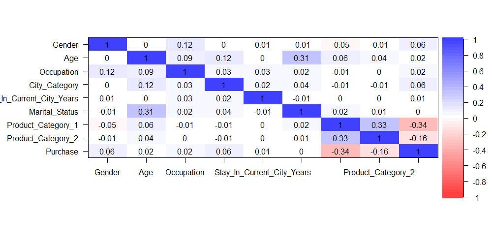
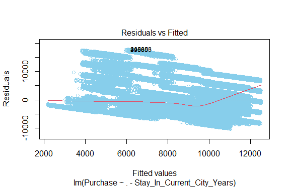
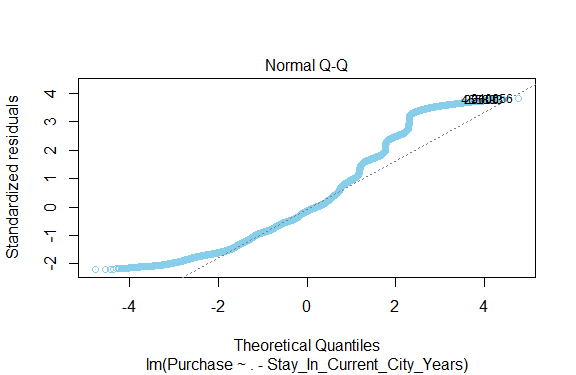
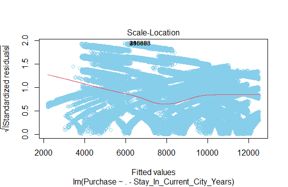
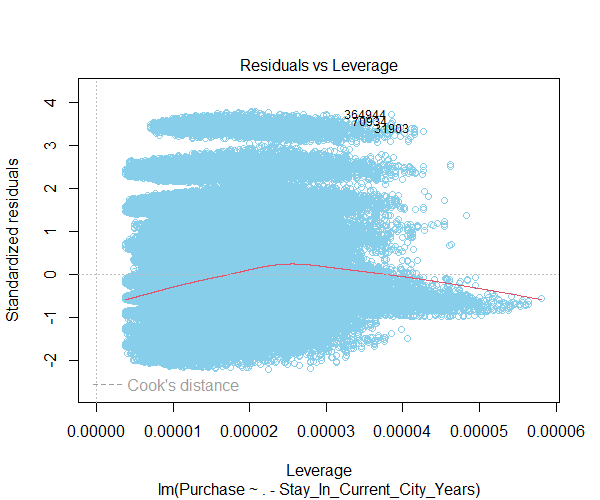
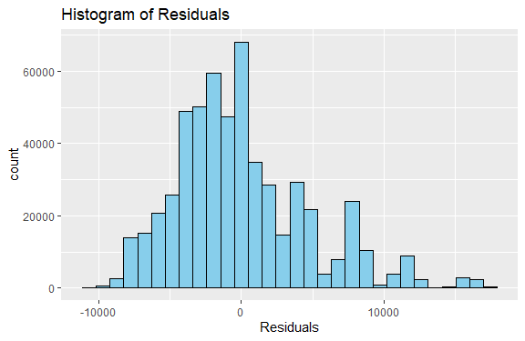
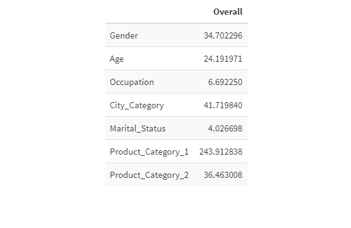
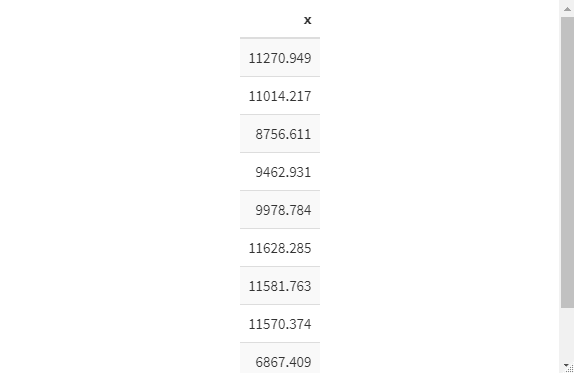

# Black-Friday-Purchase-Prediction-Using-R
### INTRODUCTION
Black Friday is a colloquial term for the Friday after Thanksgiving in the United States. It traditionally marks the start of the Christmas shopping season in the United States. Many stores offer highly promoted sales at discounted prices and often open early, sometimes as early as midnight or even on Thanksgiving.\
source: Wikipedia\
This Project seeks to predict the amount of purchase in a retail store on a black friday using R programming language.

The data set was obtained from kaggle.
# DATASET DESCRIPTION
The dataset consist of 537577 rows and 12 columns.
# Data Overview
User_ID: Unique ID of the user. There are a total of 5891 users in the dataset.\
Product_ID: Unique ID of the product. There are a total of 3623 products in the dataset.\
Gender: indicates the gender of the person making the transaction.\
Age: indicates the age group of the person making the transaction.\
Occupation: shows the occupation of the user, already labeled with numbers 0 to 20.\
City_Category: User's living city category. Cities are categorized into 3 different categories 'A', 'B' and 'C'.\
Stay_In_Current_City_Years: Indicates how long the users has lived in this city.\
Marital_Status: is 0 if the user is not married and 1 otherwise.\
Product_Category_1 to _3: Category of the product. All 3 are already labaled with numbers.\
Purchase: Purchase amount.

# This project intends to achieve the following:
1. Predict the amount of purchases by a customer using simple regression model based on certain predictor variables.
2. To identify most important variables that help predict the purchasing price.

### EXPLORATORY DATA ANALYSIS OF DATA SET
## Gender 

As can be observed that there were more male customers for the balck friday sales than the females.

## Age Distribution By Gender

We observe that most of the customers where between the age brackets 18 - 45, with the predominant age bracket being 26 - 35. This is expected because most youths prefer buying during discount promo, since they are getting the same product at a discounted price.

## City Category

City Category B had most users from the data set, We need to find out if the city has any influence on customer purchase.

## Number Of years In City

We see that most city occupants love spending only a year in any city.

## Marital Status

Black friday sales had more of single customers than married.

## Distribution Of Purchase Amount

We observe that the distribution can be fairly classified as bell shaped.

## City Vs Total Purchase

Not much can be observed from the chart, however we notice some outliers in city A and B.

## City Vs Year In City

Interestingly customers prefer spending only a year, regardless the city they live in.

## Age Vs Purchases

As we observed earlier people within the age of 26 - 35 had most purchases.

## DATA PROCESSING
To clean up the data and prepare it for model building.\
I obtained the summary of missing values in each column of the data set using the R code. **which(colSums(is.na(df_train)) > 0**. I observed there were missing value in 2 columns, Product_category_2 and Product_category_3, I proceeded to obtain the percentage of the missing value in both columns and noticed Product_category_3 had 70% of its data missing. This is much and can affect the model, I had to drop the column entirely and replaced the missing value in Product_category_2 with the median value.\

I also transformed all categorical variable with **string values** into a form that is allowed by models for our machine algorithm to make better prediction and I dropped columns that had no significant effect on the target variable like -User_ID, -Product_ID.\

**Purchase** clearly is the target variable while every other features is taken as the independent variable.\

## Building The Model and Accuracy Analysis
I used a simple linear Regression, This model, like most of the supervised machine learning algorithms, makes a prediction based on the input features. The predicted output values are used for comparisons with desired outputs I used **Summary()** function to observe the **P-Value**, **R-squared** that measures the proportion of the variation in the dependent variable explained by all of the independent variables in the model. I also took note of the **F-statistics**  

## Correlation

I observed the relationship between the features and the target variable, with some having positive correlation some had negative correlation.

## Linear Regression

After building the model I observed the following:
The P-value was okay, and discovered that both the **R-Sqaured** and the **F-statistics** can be improved since the column **Number Of Years Spent in city** does not have much influence on the purchases.

After Dropping the column, I obtained a better **F-statistics** Value.

## Model PLots

## Model Analysis

# Most important variables that help predict the purchasing price:

Using the **VarImp** I obtained columns that had most impact in the prediction of purchasing price.\

## Prediction
I loaded the test data set and used the linear model built to predict purchase price based on the independent features.\
Here is a glimpse of the first 10 rows of the predicted price.

## Conclusion:
Based on the values of the **F-statistics**, **P-value** and **R-squared** we can conclude that our model performed well but can be improved.\
We also took note that customers who want **product_Category_1** were more likely to purchase during the black friday sales.
